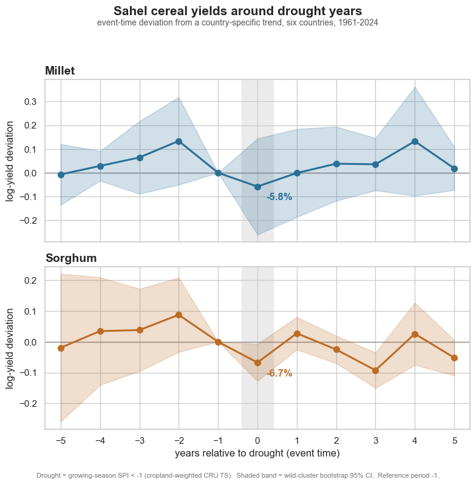

# Sahel cereal yields & climate shocks

> How much do drought years actually reduce millet and sorghum yields in the Sahel, once we control for trend?



## The question

Across six Sahel countries — Burkina Faso, Mali, Niger, Senegal, Chad, and Mauritania — millet and sorghum are the primary subsistence cereals, and drought is the dominant climate shock that perturbs them. This project asks: when a drought year happens, how much does cereal yield actually fall, *after* controlling for the long-run trend in yields? We are **not** building a yield-forecasting model — that requires more granular weather, planting, and market data than this study uses — and we are **not** attempting to attribute droughts themselves to climate change, which is a different methodology. We are estimating a single descriptive causal quantity: the average yield deviation around drought years in this region, with the standard event-study and difference-in-differences toolkit.

## Data

| Source | Granularity | Time coverage | Used for |
|--------|-------------|---------------|----------|
| [FAOSTAT crop production & yields](https://www.fao.org/faostat/en/#data/QCL) | National (admin-0) annual | 1961–2024 | Millet & sorghum yields (the dependent variable) |
| [CRU TS 4.09 climate reanalysis](https://crudata.uea.ac.uk/cru/data/hrg/) | 0.5° grid monthly | 1901–2024 | Growing-season precipitation → SPI drought flag |
| [GADM 4.1 administrative boundaries](https://gadm.org/) | Admin-0 / admin-1 polygons | Current | Rolling CRU gridcells up to country aggregates |
| [EarthStat Cropland Area 2000](http://www.earthstat.org/cropland-pasture-area-2000/) | 5-arc-min grid | Year 2000 | Cropland mask for the spatial-weighting decision (#3) |

Access date: **2026-05-19** (see `docs/DATA_ACCESS_MANIFEST.md`). **FAOSTAT revises historical figures** — the access date is pinned and a parquet snapshot written to `data/processed/faostat_snapshot_2026-05-19.parquet`; that snapshot, not the live API, is the canonical analytic input. (MODIS NDVI, listed as optional in the original scoping, was dropped: it would have added a Google Earth Engine dependency for a post-2000 cross-check that the CRU-based drought flag does not need.)

## Method

The analysis is a standard event-study design with a difference-in-differences cross-check. **Drought years** are identified using the Standardized Precipitation Index (SPI) computed from CRU TS precipitation, aggregated over each country's growing-season window. **Yields** come from FAOSTAT (millet, sorghum) by country and year, 1961–latest, log-transformed to give a percent-change interpretation and detrended against a country-specific time trend. The **event study** plots yield deviation from trend at event-time −5 through +5 around each country-year flagged as a drought, pooling across countries. The **DiD cross-check** compares yields in drought-hit countries against non-drought-hit countries in the same year, when granularity permits. The strongest critique of this approach is that "drought" defined on rainfall alone misses heat stress, planting-date shifts, and pest dynamics — all of which matter for yield — and that with six countries the panel is small enough that any one country's idiosyncrasies can drive the headline. Robustness checks address this directly.

## Methodological decisions

Each major data-processing decision was made by **diagnostic first, choice second**. The table below is an at-a-glance summary; the full five-part rationale (problem / diagnostic / options / decision + rationale / sensitivity) lives inline in `notebooks/02_main.ipynb`.

| # | Decision | Chose | Alternatives considered | Why (anchored in diagnostic) | Sensitivity |
|---|----------|-------|-------------------------|------------------------------|-------------|
| 1 | Drought definition (SPI threshold + growing-season window) | **SPI < −1.0**, cumulative over a per-country growing-season window (FAO crop calendar: Mauritania Jul–Sep, Senegal Jun–Oct, the rest Jun–Sep) | SPI < −0.8; SPI < −1.5; single-month deficit | −0.8 floods the event study with marginal events that attenuate the estimate toward zero; −1.5 leaves some of the six countries event-thin. −1.0 is the McKee "moderately dry" standard and the only cutoff that keeps every country identifiable. | **Sign-robust.** Drought-year deviation stays negative for both crops at all three thresholds. −1.0 is the *mildest* reading — −0.8 deepens millet `et0` to −14.3%, −1.5 deepens both crops. |
| 2 | Trend specification (per-country detrend) | **Linear** | Quadratic; natural cubic spline (df=4) | A flexible per-country trend bends *through* the clustered 1970s and mid-1980s drought decades and absorbs the very dip being measured. Linear cannot. | **Not sensitive.** `et0` moves ≤ 0.016 log points across linear / quadratic / spline. The flexible specs only shave residual SD. |
| 3 | Spatial weighting (CRU 0.5° grid → country aggregate) | **Cropland-area-weighted** (EarthStat Cropland 2000) | Area-weighted; population-weighted | Area-weighting treats Saharan and cropland cells equally — indefensible where most of Mauritania and northern Mali is desert. Cropland weighting measures rainfall where the crops actually grow. | **Load-bearing.** Switching to area weighting swaps which crop is precisely estimated (area: millet `et0` −10.5%, significant; sorghum n.s. — the mirror image of the cropland headline). Both crops stay negative under both. |
| 4 | Inclusion of partial drought years (one or two countries in drought, others not) | **Keep all partial-drought years** | Exclude partial years; exclude singleton-drought years | The DiD is identified almost entirely off partial years — only 6 of 64 years are pan-Sahel droughts and 19 carry within-year contrast. Excluding partial years would gut identification. | **Not sensitive.** Dropping singleton-drought years barely moves the DiD coefficient. |
| 5 | Robust standard errors (n = 6 country clusters) | **Wild-cluster bootstrap** by country (headline); country-clustered reported alongside | One-way country; one-way year; two-way country × year | With only six clusters the conventional cluster-robust estimator is biased downward and over-rejects. The wild-cluster bootstrap (Cameron, Gelbach & Miller 2008) is the standard small-cluster correction. | **The point estimate is identical across schemes — only the interval moves, and a lot.** Sorghum `et0` is significant under country / wild clustering but not under year / two-way. Significance is scheme-dependent. |
| 6 | FAOSTAT revision snapshot (FAOSTAT revises history) | **Pin the 2026-05-19 snapshot** as canonical | Read FAOSTAT live every run; pin with a scheduled auto-refresh | A descriptive study's headline number must be reproducible — reading live would silently change it with no code change (Principle 2: reliability over a marginal freshness gain). | The revision-magnitude delta needs a second snapshot to observe; until then, revision *exposure* is bounded by the share of country-years carrying a non-official FAOSTAT flag (notebook Decision 6). |

> Brand note: every choice above is an *educated* decision, not a convention. The full five-part rationale — problem, diagnostic code, named options, decision, sensitivity check — is inline in `notebooks/02_main.ipynb`; `notebooks/03_robustness.ipynb` re-runs the estimation across the perturbations behind the Sensitivity column.

## Findings

Across six Sahel countries and six decades (1961–2024):

- **A drought year is associated with a below-trend cereal-yield deviation of roughly −6% to −8%.** A drought is a growing-season SPI below −1, with CRU precipitation cropland-weighted to the country level.
- **Sorghum: the effect is statistically clear.** Event-study `et0` = −6.7% (wild-cluster bootstrap 95% CI [−12.7%, −0.7%], p = 0.03); the difference-in-differences cross-check agrees at −7.2% (p = 0.03).
- **Millet: same sign and comparable magnitude, but imprecise.** Event-study `et0` = −5.8% (wild CI [−26.0%, +14.4%], p = 0.41); DiD −7.7% (p = 0.09). The point estimate is squarely negative; with six country clusters the interval is simply too wide to distinguish it from zero.
- **The sign and rough magnitude are fully robust.** Across all 19 robustness refits — alternate SPI thresholds, trend specs, drop-one-country, alternate clustering, and area vs. cropland weighting — `et0` is negative for *both* crops *every single time* (millet in [−14.3%, −1.8%], sorghum in [−15.8%, −4.8%]).
- **What is not robust is precision.** *Which* crop comes out significant depends on the spatial-weighting scheme and the SE-clustering choice. The honest one-line summary: the drought-year yield penalty is **directionally certain, imprecisely pinned**.

The hero figure above shows the full event-time path; `notebooks/03_robustness.ipynb` shows every refit.

## Limitations

- **Rainfall-only drought definition.** SPI captures precipitation deficit, not heat stress, planting-date shifts, or pest dynamics — all of which depress yield and often co-occur with drought. The estimate is the effect of *a rainfall-defined drought year*, not of every agronomic stress.
- **Six-country panel.** With only six clusters, any one country's idiosyncrasies can move the headline, and small-cluster inference is genuinely hard — this is why significance, not sign, is the fragile part of the result.
- **National annual aggregates.** FAOSTAT yields are admin-0 annual figures; they hide within-country heterogeneity (a drought concentrated in one growing region is averaged against unaffected regions).
- **CRU TS is an interpolated reanalysis.** Station density is sparse in the Sahel, so the gridded precipitation product carries more uncertainty than its smooth appearance suggests.
- **An average effect, descriptive in scope.** The design estimates a pooled average drought-year deviation. It is not a yield forecast, not an attribution of the droughts themselves to climate change, and not precise enough at the country-year level to inform policy in any single year.

## Visual style

This project uses **matplotlib + seaborn** for the event-study plot, the DiD coefficient plots, the robustness panels, and the hero figure (event-time yield deviation ± 5 years around drought, pooled). Justification: this is the most "academic econ" project in the portfolio, and event-time coefficient plots with shaded confidence bands read best as static publication-quality figures. The deliverables here are figures that should land cleanly in a static PDF or a recruiter-facing LinkedIn post, not interactive widgets.

## How to reproduce

```bash
git clone <url>
cd 02-sahel-yields-climate

# Install with the stats + viz extras
pip install -e ".[viz,stats]"

# Run the analysis, then the robustness companion
jupyter lab notebooks/02_main.ipynb
jupyter lab notebooks/03_robustness.ipynb
```

The four raw datasets are downloaded manually into `data/raw/` — see `docs/DATA_MANIFEST.md` for the exact URLs and on-disk paths. They are not committed (the CRU TS file alone is ~6 GB); the pinned FAOSTAT snapshot and the derived analytic panel *are* derived from them and the snapshot is committed.

Run `02_main.ipynb` first: it writes `data/processed/analytic_panel.parquet`, which `03_robustness.ipynb` reads. Each notebook runs in ~3–5 minutes — the slow step is the CRU 0.5°-gridcell → country spatial intersection (~30–60 s); the wild-cluster bootstrap accounts for most of the rest.

## Files

- `notebooks/02_main.ipynb` — the analysis (start here)
- `notebooks/03_robustness.ipynb` — alternate drought definitions, alternate trend controls, partial-year sensitivity, alternate clustering of SEs
- `src/sahel_yields/data.py` — FAOSTAT, CRU TS, GADM, cropland loaders with snapshot pinning
- `src/sahel_yields/climate.py` — SPI computation, growing-season aggregation, gridcell → country spatial weighting
- `src/sahel_yields/econ.py` — event-study and DiD estimators with chosen SE clustering
- `src/sahel_yields/viz.py` — event-time plot, coefficient plot, robustness-panel helpers (matplotlib + seaborn)
- `src/sahel_yields/diagnostics.py` — diagnostic helpers used in decision blocks
- `data/raw/` — fetched source files (gitignored if large)
- `data/processed/faostat_snapshot_YYYY-MM-DD.parquet` — pinned FAOSTAT snapshot (committed)
- `data/processed/` — derived analytic dataset (parquet, committed)
- `figures/` — saved figures, including `hero.png` (committed)
- `tests/test_smoke.py` — minimal smoke tests

## Author

Muhanad — [LinkedIn](URL) · [Twitter](URL)
