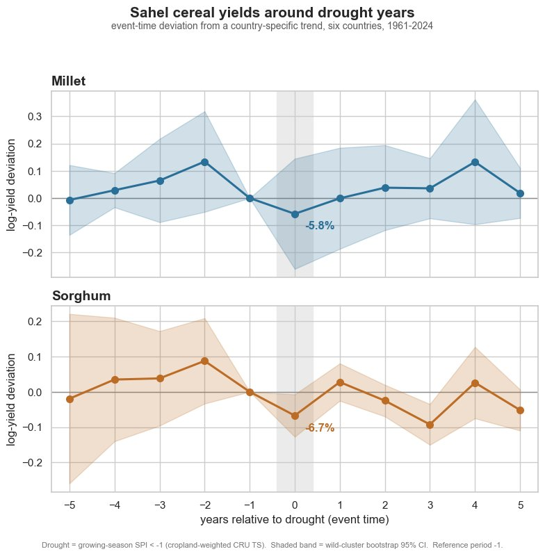
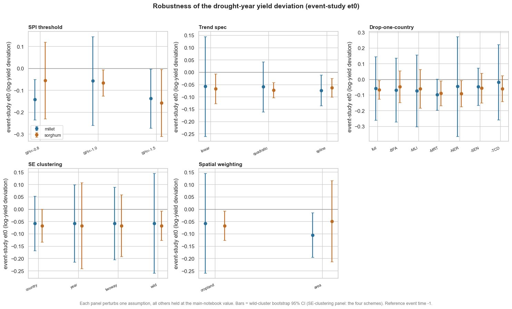
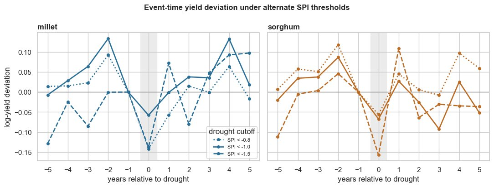

# Sahel cereal yields and climate shocks

### A descriptive panel estimate of the drought-year yield deviation for millet and sorghum, 1961-2024

**Author:** Muhanad Husn
**Repository:** [`Muhanad-husn/Sahel-cereal-yields-climate-shocks`](https://github.com/Muhanad-husn/Sahel-cereal-yields-climate-shocks)
**Stack:** Python (pandas, statsmodels, xarray, matplotlib, seaborn) · FAOSTAT · CRU TS 4.09 · GADM 4.1 · EarthStat Cropland2000

---

## Executive summary

Across six Sahel countries — Burkina Faso, Mali, Niger, Senegal, Chad, and Mauritania — and six decades of FAOSTAT yield data joined to CRU TS precipitation, a drought year is associated with a below-trend cereal-yield deviation of roughly **–6% to –8%**. The effect is statistically clear for sorghum (event-study coefficient at event time 0, henceforth `et0`, of –6.7% with a wild-cluster bootstrap 95% CI of [–12.7%, –0.7%], p = 0.03; difference-in-differences cross-check at –7.2%, p = 0.03) and directionally consistent but imprecise for millet (event study `et0` –5.8%, p = 0.41; DiD –7.7%, p = 0.09).

The sign and rough magnitude are fully robust. Across 19 robustness refits spanning alternate SPI thresholds, alternate trend specifications, leave-one-country-out refits, alternate clustering of standard errors, and area- versus cropland-weighted rainfall aggregation, `et0` is negative for both crops every single time — millet in the range [–14.3%, –1.8%], sorghum in [–15.8%, –4.8%]. What is *not* robust is precision: which crop comes out statistically significant depends on the spatial-weighting scheme and the choice of clustering, swapping cleanly between millet and sorghum under area weighting.

The honest one-line summary: the drought-year yield penalty is **directionally certain, imprecisely pinned**. This is not a flaw to be papered over; it is the genuine ceiling of a six-country, six-decade descriptive panel, and the project is designed to surface that ceiling rather than disguise it.

---

## The question and what this study is not

Millet and sorghum are the load-bearing subsistence cereals across the Sahel — they feed tens of millions of people directly, as food security rather than as a tradable commodity. The relationship between rainfall variability and yield is therefore the central climate-adaptation question for the region. The public debate around that relationship is too often dominated by narrative or by single-country case studies, where one bad year drives a sweeping claim.

This project takes the opposite tack. It asks one quantitative question and answers it with a six-country panel and a small set of pre-registered design choices: **when a drought year happens, how much does cereal yield actually fall, after controlling for the long-run trend in yields?**

The scope is deliberately narrow. The study is *not* a yield forecast — that requires more granular weather, planting, soil, and market data than this design uses. It is *not* an attribution of the droughts themselves to climate change, which is a different methodology with different inputs. And it is *not* fine-grained enough to inform policy in any single country in any single year. What it produces is a single descriptive causal quantity: the average yield deviation around drought years across the Sahel, with the standard event-study and difference-in-differences toolkit, and an explicit account of where that quantity is precise and where it is not.

---

## Data

The analytic panel is built from four open data sources, with one access date pinned for reproducibility:

| Source | Granularity | Time coverage | Role |
| --- | --- | --- | --- |
| FAOSTAT crop production & yields | National annual | 1961-2024 | Millet and sorghum yields — the dependent variable |
| CRU TS 4.09 climate reanalysis | 0.5° grid, monthly | 1901-2024 | Growing-season precipitation, mapped to SPI |
| GADM 4.1 administrative boundaries | Admin-0 / admin-1 polygons | Current | Rolling CRU gridcells up to country aggregates |
| EarthStat Cropland Area 2000 | 5-arc-min grid | Year 2000 | Cropland mask for cropland-weighted SPI |

The FAOSTAT pull is treated as a pinned artefact, not a live feed. FAOSTAT revises historical figures as countries submit corrections, and the same query run six months apart can return slightly different numbers. For a descriptive study whose whole purpose is reproducibility, that silent drift would be corrosive. The repository commits a date-stamped snapshot (`faostat_snapshot_2026-05-19.parquet`) and reads only from it; re-fetching is an explicit documented step, never implicit.

One originally optional source, MODIS NDVI, was dropped. It would have added a Google Earth Engine dependency for a post-2000 cross-check that the CRU-based drought flag does not require, and the cost in pipeline complexity exceeded the value of the marginal check.

---

## Methodology

The design is a standard event-study with a difference-in-differences cross-check. Both estimators target the same descriptive quantity from slightly different identifying variation, which is the point: if they agree, the estimate is more credible.

**Drought years** are identified using the Standardized Precipitation Index (SPI), built from CRU TS precipitation. The pipeline weights each 0.5° CRU gridcell up to a country aggregate by its overlap with that country's cropland (EarthStat 2000), sums precipitation over each country's growing-season window from the FAO crop calendar (Mauritania July-September, Senegal June-October, the rest June-September), fits a gamma distribution per country on the full 1901-2024 climatology, and maps each season total to its SPI value following McKee et al. (1993). A country-year is flagged as a drought when its growing-season SPI falls below –1.0 — the literature-standard "moderately dry" cutoff.

**Yields** come from FAOSTAT for millet and sorghum, by country and year, 1961-2024. They are log-transformed to give a percent-change interpretation and detrended against a per-country linear time trend. The detrending is structural rather than cosmetic: yield baselines drift over six decades because of improved seed varieties, fertiliser access, and shifts in area under cultivation, and the event study works on the *deviation* of yield from that trend rather than the level.

**The event study** regresses detrended log yield on event-time dummies spanning –5 to +5 years around each drought year, with country and year fixed effects. The year before the drought (event time –1) is the omitted reference period. The coefficient at event time 0 is the average drought-year yield deviation; the coefficients at –5 to –2 act as a placebo check (they should sit near zero if the design is not picking up a spurious pre-trend).

**The DiD cross-check** uses a single current-year drought indicator with country and year fixed effects, so the drought coefficient compares drought-hit countries to non-drought-hit countries observed in the same year. The two designs lean on different variation — event study on timing within country, DiD on within-year contrast across countries — which is why their agreement matters.

**Inference** uses the wild-cluster bootstrap by country (Cameron, Gelbach & Miller 2008) as the headline standard-error scheme, with conventional country-clustered intervals reported alongside for transparency. With only six country clusters, the conventional cluster-robust estimator is biased downward and over-rejects; the wild bootstrap is the standard small-cluster correction.

---

## Methodological decisions: diagnostic first, choice second

Every load-bearing data-processing choice was made by running a diagnostic on the actual data and then picking among named alternatives — not by convention. The repository documents each in a five-part block (problem, diagnostic, options, decision + rationale, sensitivity) inline in `notebooks/02_main.ipynb`. The summary below condenses the six decisions and the reason each one is the way it is.

### Decision 1 — Drought threshold

The SPI cutoff sets a trade-off: a lax threshold floods the event study with marginal events that attenuate the estimate toward zero, while a strict threshold keeps only severe droughts but leaves too few events to identify event-time coefficients across just six countries. The chosen value is `SPI < –1.0`. A diagnostic showed that `SPI < –0.8` pushes the drought share toward a third of all country-years (too lax to read as a shock against a non-drought baseline) and that `SPI < –1.5` leaves some countries with only a handful of events (too thin for stable event-time coefficients). The chosen `–1.0` is both the McKee "moderately dry" standard and the only cutoff that keeps every country adequately populated. The robustness notebook re-runs the estimation at all three cutoffs.

### Decision 2 — Trend specification

The detrend is per-country linear. A more flexible per-country trend (quadratic, or a natural cubic spline with four degrees of freedom) shaves residual SD modestly (millet 0.259 → 0.245 → 0.236; sorghum 0.255 → 0.208 → 0.199), and the `et0` coefficient is stable across all three specs (millet –0.058 / –0.059 / –0.074; sorghum –0.067 / –0.073 / –0.064). The headline does not depend on the spec. Given that, the linear trend is chosen for being structurally the most conservative: with the Sahel droughts clustered in the early 1970s and mid-1980s, a per-country spline has a real risk of bending *through* those drought decades and absorbing the very dip the event study is trying to measure. A linear trend cannot bend through them, so it can neither manufacture nor hide the effect.

### Decision 3 — Spatial weighting

CRU TS is a 0.5° (~55 km) grid, so rolling cells up to a country series needs a weighting rule. Three were considered: simple area weighting, cropland-area weighting (overlap area scaled by the EarthStat year-2000 cropland fraction of each cell), and population weighting (rejected on substance — population has no bearing on where a rainfed cereal is grown). The chosen rule is **cropland-area weighting**. Area weighting treats Saharan and cropland cells equally, which is indefensible where most of Mauritania and northern Mali is desert: empty cells with no agriculture would outvote the cultivated south on what counts as a drought. Cropland weighting measures rainfall where the crops actually grow.

This decision is the most load-bearing of the six. Switching to area weighting swaps which crop is precisely estimated — millet `et0` deepens to –10.5% and turns significant, sorghum weakens to –4.9% and loses significance — the mirror image of the cropland headline. Both crops stay negative under both weightings, so the *direction* is robust, but *which crop* carries the significant effect is not.

### Decision 4 — Partial drought years

Drought rarely hits all six countries at once. In a partial-drought year, one to three countries are below the SPI threshold while the rest have a normal season. The decision was to keep all country-years, including the partial ones. The reason is identification: only 6 of 64 years are pan-Sahel droughts, while 19 carry within-year contrast across countries. The DiD identifies the drought effect *within* each year against non-drought countries observed the same year, and in a pan-Sahel year there is no within-year contrast at all — the year fixed effect absorbs it completely. Excluding partial years would not weaken the DiD, it would gut it. The known spillover concern (a drought-hit country's neighbour being indirectly affected) is bounded here because the outcome is national cereal yield, and rainfed millet and sorghum production does not cross borders.

### Decision 5 — Standard error clustering

With six country clusters and within-country serial correlation in drought shocks (a dry decade is dry for several consecutive seasons), SEs must be cluster-robust on the country dimension. The conventional country-clustered SE is biased downward with so few clusters, so the headline scheme is the **wild-cluster bootstrap by country**, with the conventional country-clustered interval reported alongside.

The diagnostic on this is important because it shows how consequential the choice is. The sorghum event-study `et0` p-value runs 0.049 (country) / 0.45 (year) / 0.29 (two-way) / 0.031 (wild) — the same coefficient reads as significant, not significant, or borderline depending entirely on the SE scheme. Year-clustering is rejected on substance (it assumes drought shocks are independent across countries within a year, which the pan-Sahel droughts plainly violate); among the defensible schemes the wild bootstrap is the literature-standard small-cluster correction.

### Decision 6 — FAOSTAT snapshot pinning

FAOSTAT revises historical figures, so the same query run later can return different numbers. The chosen rule is to pin a dated snapshot (`2026-05-19`) and read only from it. For a descriptive study whose headline number must be reproducible, the alternative — reading live every run — would silently change that number with no code change at all. The trade-off accepted is a marginal loss in data currency for a categorical gain in reliability.

---

## Findings

### Headline estimate

A drought year — defined as a country-year with growing-season SPI below –1.0 under cropland-weighted CRU aggregation — is associated with a detrended log-yield deviation of roughly **–6% to –8%** across the six Sahel countries from 1961 to 2024.

For **sorghum**, the effect is statistically clear. The event study puts `et0` at –6.7% (wild-cluster bootstrap 95% CI [–12.7%, –0.7%], p = 0.03), and the difference-in-differences cross-check agrees at –7.2% (p = 0.03). The two designs identify the effect off different variation, and their agreement is the consistency check the design is built to support.

For **millet**, the point estimate has the same sign and a comparable magnitude, but it is imprecise. The event study returns `et0` = –5.8% (wild CI [–26.0%, +14.4%], p = 0.41); the DiD returns –7.7% (p = 0.09). Both estimates are squarely negative, but with six country clusters the interval is too wide to distinguish the millet effect from zero. Under area weighting, that pattern flips: millet sharpens to –10.5% with a tight interval, and sorghum widens.

The hero figure shows the full event-time path for both crops, with the wild-bootstrap 95% confidence band around each event-time coefficient.



Two things are worth reading directly off the figure beyond the headline numbers. The pre-drought coefficients (–5 to –2) sit near zero and are not individually significant for either crop, which is the placebo result the design needs: the drop is concentrated at the drought year, not a pre-existing divergence. And the sorghum panel shows a second negative coefficient at event time +3, hinting at a delayed second dip — consistent with multi-year drought spells, though with this many event-time terms some caution about multiple comparisons is warranted.

### Robustness

The robustness companion (`notebooks/03_robustness.ipynb`) re-runs the estimation 19 times, perturbing one assumption at a time while holding everything else at its main-notebook value. The five axes are the SPI threshold, the trend specification, leave-one-country-out, the SE clustering scheme, and the cropland- vs area-weighted spatial aggregation.

Across all 19 refits, the event-study `et0` is **negative for both crops every single time** — millet in [–14.3%, –1.8%] with a mean of –7.0%, sorghum in [–15.8%, –4.8%] with a mean of –7.1%. The headline magnitude of –6% to –8% is, if anything, a conservative reading: the mean across refits is around –7%, and several specifications reach –14% to –16%.

The consolidated robustness panel makes the band visible at a glance — every dot is a refit's `et0`, every error bar is its 95% interval, every panel perturbs one assumption.



The pattern of confidence intervals across panels tells the precision story: the markers stay clustered in negative territory across every panel (the direction is robust), while the bars are wide enough that significance comes and goes (the precision is not). Three findings from the robustness notebook are worth naming explicitly:

The **drop-one-country** panel shows that no single country drives the result. Across all six leave-one-out refits the `et0` stays negative for both crops — millet in [–9.8%, –1.8%], sorghum in [–9.2%, –4.8%]. Dropping Chad pulls the millet `et0` closest to zero (–1.8%); dropping Mauritania or Niger deepens the sorghum effect (–9.0% / –9.2%). None of the six leave-out refits reverses the sign on either crop.

The **SPI threshold** panel is the one where magnitude moves most. At the lax –0.8 cutoff the millet `et0` deepens to –14.3%; at the strict –1.5 cutoff both crops deepen (millet –13.8%, sorghum –15.8%). The chosen –1.0 cutoff is the *mildest* reading of the three. The event-time view across thresholds visualises this directly:



The **spatial weighting** panel is the consequential axis. Both crops stay negative under both weightings, but which crop is precisely estimated swaps cleanly between them. This is the one robustness finding that should make a reader uncomfortable, and the project does not hide it: the per-crop precision claim is conditional on cropland weighting being the right choice, and the substantive case for that choice (rainfall matters where the crop grows, not over desert) is what the report stands on.

What does *not* survive cleanly is statistical significance. It is crop-, threshold-, weighting-, and SE-scheme-dependent. The sorghum effect that is significant under the cropland / `SPI < –1` / wild headline does not survive any single-country drop, weakens under year- or two-way clustering, and flips over to millet under area weighting. This is not a flaw in the estimate; it is the honest ceiling of a six-country, six-decade descriptive panel, and the robustness exercise is what makes that ceiling visible.

---

## Limitations

The estimate is bounded in several substantive ways, and a portfolio reader is owed each one without softening.

The drought definition is **rainfall-only**. SPI captures precipitation deficit, but it does not capture heat stress, planting-date shifts, or pest dynamics — all of which depress yield and often co-occur with drought. What the design estimates is the average yield deviation in *a rainfall-defined drought year*, not the effect of every agronomic stress that drought entails. A reader who wants the broader stress concept should add temperature-stress and pest indices to the right-hand side; that is a different study.

The panel is **six countries**. With only six clusters, any one country's idiosyncrasies can move the headline (the drop-one-country axis quantifies this) and small-cluster inference is genuinely hard (the SE-clustering axis quantifies that). Significance, not sign, is the fragile part of the result, and it is fragile because the panel is fundamentally small — not because the estimator is wrong.

The yields are **national annual aggregates**. FAOSTAT yields are admin-0 figures, so they hide within-country heterogeneity. A drought concentrated in one growing region of Mali is averaged against unaffected regions in the same country-year, which attenuates the effect on whichever country is large and agro-ecologically diverse. Going subnational would change the answer; it would also require subnational yield data, which FAOSTAT does not supply.

CRU TS is an **interpolated reanalysis**. Station density is sparse in the Sahel, so the gridded precipitation product carries more uncertainty than its smooth appearance suggests. The cropland weighting partially mitigates this by downweighting empty Saharan cells where the interpolation has the least support, but the underlying input uncertainty does not disappear.

The estimate is **a pooled average, descriptive in scope**. The design measures an average drought-year deviation across countries and decades. It is not a yield forecast for any single country in any single year, not an attribution of the droughts themselves to climate change, and not granular enough to support country-specific policy claims. A reader who wants any of those things needs a different design.

---

## Reproducibility

The repository is structured to run end-to-end from the pinned FAOSTAT snapshot and the raw CRU / GADM / EarthStat inputs. The package layout separates concerns cleanly: `data.py` handles snapshot pinning and source loaders, `climate.py` handles SPI computation and the gridcell-to-country spatial weighting, `econ.py` holds the event-study and DiD estimators with the chosen SE clustering, `viz.py` holds the figure helpers, and `diagnostics.py` holds the helpers used inside each decision block.

Reproduction is one command:

```bash
pip install -e ".[viz,stats]"
jupyter lab notebooks/02_main.ipynb
jupyter lab notebooks/03_robustness.ipynb
```

The raw datasets are downloaded manually into `data/raw/` (see `docs/DATA_MANIFEST.md` for URLs and on-disk paths) and are not committed — the CRU TS file alone is around 6 GB. The pinned FAOSTAT snapshot is committed, and the derived analytic panel parquet is written by the main notebook and read by the robustness notebook. Each notebook runs in around 3-5 minutes; the slow step is the CRU 0.5°-gridcell to country spatial intersection (30-60 seconds), and the wild-cluster bootstrap accounts for most of the rest.

A minimal smoke test (`tests/test_smoke.py`) verifies the pipeline runs end-to-end without checking specific numerical outputs.

---

## What this project demonstrates

The technical surface is a small panel applied-econometrics workflow: gridded climate data joined to administrative agricultural statistics, an event study with a DiD cross-check, and small-cluster honest inference. The portfolio surface is rather different and arguably more useful to a reader evaluating the work.

The first thing to notice is that **every load-bearing data-processing choice is documented as a five-part decision block**: problem, diagnostic, options, decision + rationale, sensitivity. The choice is anchored in a diagnostic on the actual data, not picked from convention; the alternatives are named, not implied; and each is then re-run in the robustness companion. This pattern is reusable beyond agronomy — it is how any small-panel descriptive study should defend its specification choices.

The second is the **separation of sign from significance** in the headline. The drought-year yield penalty is *directionally certain and economically sizeable* — every refit returns a negative `et0` and the mean across refits is around –7%. It is *imprecisely pinned* — the per-crop significance moves with the spatial-weighting scheme and the SE clustering, and the report flags this rather than glossing it. A small panel can carry one of these claims clearly; it cannot carry both at the same headline strength, and the report is honest about which one it carries.

The third is the **scoping discipline** stated up front and reinforced at the end. The work is not a forecast, not an attribution study, and not policy-grade at the country-year level. Stating the scope tightly is what makes the descriptive claim defensible.

The drought-year yield penalty in the Sahel is real, sized in the high single digits, and present in every robustness refit run on this data — and a richer attribution of that penalty to its component stressors needs richer data than national annual yields and gridded rainfall alone.
